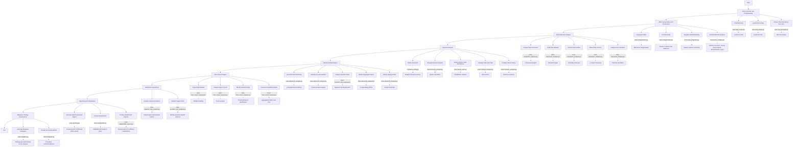

# Detailed Process Flow

```mermaid
graph TD
    A[Start] --> B[Data Collection and Preprocessing]
    B --> C[Risk Categorization and Prioritization]
    C --> D[Risk Interaction Analysis]
    D --> E[Scenario Analysis]
    E --> F[Advanced Risk Analysis]
    F --> G[Time Series Analysis]
    G --> H[Resilience Assessment]
    H --> I[Reporting and Visualization]
    I --> J[Mitigation Strategy Development]
    J --> K[End]

    %% Data Collection and Preprocessing
    B --> B1[Load Risk Data]
    B --> B2[Load External Data]
    B --> B3[Extract Risk Statements from 10-K]

    %% Risk Categorization and Prioritization
    C --> C1[Categorize Risks]
    C --> C2[Prioritize Risks]
    C --> C3[Integrate SASB Materiality]
    C --> C4[Perform PESTEL Analysis]

    %% Risk Interaction Analysis
    D --> D1[Analyze Risk Interactions]
    D --> D2[Build Risk Network]
    D --> D3[Identify Central Risks]
    D --> D4[Detect Risk Clusters]
    D --> D5[Analyze Risk Cascades]

    %% Scenario Analysis
    E --> E1[Define Scenarios]
    E --> E2[Simulate Scenario Impacts]
    E --> E3[Perform Monte Carlo Simulations]
    E --> E4[Calculate VaR and CVaR]
    E --> E5[Conduct Stress Testing]

    %% Advanced Risk Analysis
    F --> F1[Generate Risk Narratives]
    F --> F2[Identify Key Uncertainties]
    F --> F3[Analyze Systemic Risks]
    F --> F4[Assess Aggregate Impact]
    F --> F5[Identify Tipping Points]

    %% Time Series Analysis
    G --> G1[Project Risk Impacts]
    G --> G2[Analyze Impact Trends]
    G --> G3[Identify Critical Periods]
    G --> G4[Forecast Cumulative Impact]

    %% Resilience Assessment
    H --> H1[Evaluate System Resilience]
    H --> H2[Identify Trigger Points]

    %% Reporting and Visualization
    I --> I1[Generate Risk Assessment Report]
    I --> I2[Create Visualizations]
    I --> I3[Produce Stakeholder Reports]

    %% Mitigation Strategy Development
    J --> J1[Generate Mitigation Strategies]
    J --> J2[Provide Recommendations]

    %% Annotations
    B1 -.-> |Uses data_loader.py| B_note1[Load from CSV]
    B2 -.-> |Uses data_loader.py| B_note2[Load from CSV]
    B3 -.-> |Uses nlp_extraction.py| B_note3[NLP Processing]
    
    C1 -.-> |Uses categorization.py| C_note1[Multi-level categorization]
    C2 -.-> |Uses categorization.py| C_note2[Based on impact and likelihood]
    C3 -.-> |Uses sasb_integration.py| C_note3[Industry-specific materiality]
    C4 -.-> |Uses pestel_analysis.py| C_note4[Political, Economic, Social, Technological, Environmental, Legal]

    D1 -.-> |Uses interaction_analysis.py| D_note1[LLM-based analysis]
    D2 -.-> |Uses interaction_analysis.py| D_note2[NetworkX graph]
    D3 -.-> |Uses interaction_analysis.py| D_note3[Centrality measures]
    D4 -.-> |Uses interaction_analysis.py| D_note4[K-means clustering]
    D5 -.-> |Uses interaction_analysis.py| D_note5[Cascade simulation]

    E1 -.-> |Defined in config.py| E_note1[Multiple climate scenarios]
    E2 -.-> |Uses scenario_analysis.py| E_note2[Impact calculation]
    E3 -.-> |Uses monte_carlo.py| E_note3[Probabilistic analysis]
    E4 -.-> |Uses scenario_analysis.py| E_note4[Risk metrics]
    E5 -.-> |Uses scenario_analysis.py| E_note5[Extreme scenarios]

    F1 -.-> |Uses advanced_analysis.py| F_note1[LLM-generated narratives]
    F2 -.-> |Uses advanced_analysis.py| F_note2[Cross-scenario analysis]
    F3 -.-> |Uses systemic_risk_analysis.py| F_note3[Systemic risk identification]
    F4 -.-> |Uses advanced_analysis.py| F_note4[Compounding effects]
    F5 -.-> |Uses advanced_analysis.py| F_note5[Critical thresholds]

    G1 -.-> |Uses time_series_analysis.py| G_note1[ARIMA modeling]
    G2 -.-> |Uses time_series_analysis.py| G_note2[Trend analysis]
    G3 -.-> |Uses time_series_analysis.py| G_note3[Threshold-based identification]
    G4 -.-> |Uses time_series_analysis.py| G_note4[Aggregated impact over time]

    H1 -.-> |Uses systemic_risk_analysis.py| H_note1[Network and impact-based metrics]
    H2 -.-> |Uses systemic_risk_analysis.py| H_note2[Identify potential cascade initiators]

    I1 -.-> |Uses reporting.py| I_note1[Comprehensive JSON and HTML reports]
    I2 -.-> |Uses visualization.py| I_note2[Matplotlib and Seaborn plots]
    I3 -.-> |Uses stakeholder_reports.py| I_note3[Tailored reports for different stakeholders]

    J1 -.-> |Uses mitigation.py| J_note1[Strategy generation based on risk analysis]
    J2 -.-> |Uses mitigation.py| J_note2[Prioritized recommendations]
```